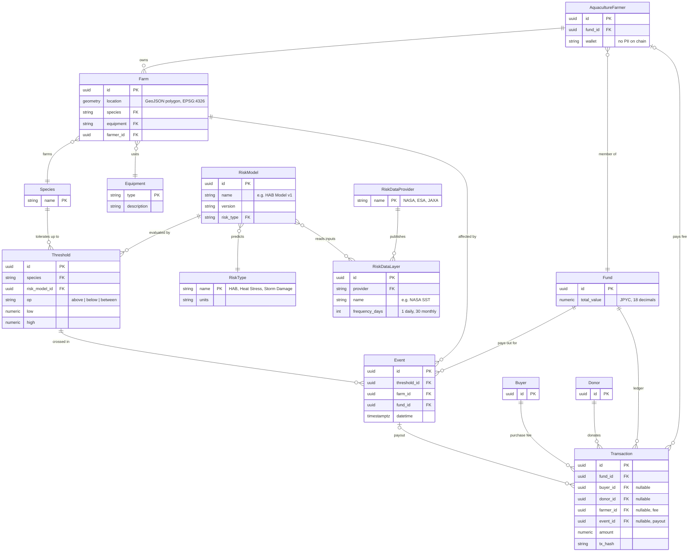

<p align="center"></p>

# Reel Deal

**Community-funded relief payments for aquaculture farmers.**

Parametric relief for Japan's aquaculture farmers: donors fund a pool, a public ocean
risk index (JAXA satellite data, prefecture shipping-restriction bulletins) crosses a
species threshold, and JPYC pays out on Sepolia to the ENSv2-registered owner of the
affected plot's season slot — capped per real person with World ID, explained and
delivered over LINE.

Built at ETHGlobal Tokyo 2026 (Classic track). For the submission write-up —
sponsor-by-sponsor integration table with code references and proof transactions,
deployed addresses, demo script, team, and an honest list of what's real today versus
what's still in progress — see **[docs/SUBMISSION.md](docs/SUBMISSION.md)**.

- Demo video: <https://ethglobal.com/showcase/reel-deal-gysa9>
- Farmer app (LINE LIFF): <https://liff.line.me/2011749457-SgvM5ahH>
- Astro app: <https://app.13-196-78-137.sslip.io> · Pipeline risk API: <https://13-196-78-137.sslip.io>
- ReliefPool demo pool (Sepolia): [`0xB258…43e5`](https://sepolia.etherscan.io/address/0xB25888A81B6F2D337c2f0CBFB863324F258c43e5) (first live payout: [`0x560E…96D32`](https://sepolia.etherscan.io/address/0x560E8404be74DCB7F3877835F374CF1B1B696D32)) · SaleRouter: [`0xfc17…58bd`](https://sepolia.etherscan.io/address/0xfc178e7fA7b3119e2E233FeDF5e2E317D95658bd) · HumanRegistry: [`0xc713…D4F8`](https://sepolia.etherscan.io/address/0xc713c174b33B071f7Bf6dC571E3dd7BfB441D4F8)

---

Reel Deal is a fisheries and aquaculture relief fund for climate change, harmful algal blooms, and storm damages. With increasing uncertainty of conditions, fisherman and aquaculture operators are facing financial challenges to respond and adapt. This relief fund is designed to be funded by the sale of local goods, informed by real-time data from satellite imagery and existing oceanographic sensor networks, and transparent and timely release of funds to affected fisherman / aquaculture farms. The scale of the project is within Japan's Exclusive Economic Zone.

Insurance is the regular collection of manageable funds before an event that catastrophically damages or negatively effects the business, so that the fund can pay out to affected beneficiaries in the case of the event.

The policyholder pays the fund, the fund manages the money and pays the beneficiaries in the case of event.

Types of insurance:

1. Conventional, damages-based insurance: In this form of insurance, the policyholder pays the fund regularly. When event defined by the policy occurs (ex. car accident), the insurance company evaluates the damages and pays out depending on the value of damages. The beneficiary receives the fund after the damage is estimated.  
2. Parametric insurance: In this form of insurance the policyholder pays the fund regularly. When the event defined by the policy occurs, the payout is triggered by event thresholds rather than the damages that occured. For example, in wildfire scenario, the insurance payout is triggered by the property reaching excessive temperature (ex. above 200 deg C). Benefit is that this insurance does not require someone to assess damages and funds are released sooner, so can be used for responding to the triggered event.

We are working with parametric insurance model, with thresholds crossed leading to release of funds.

The thresholds are defined by the species and equipment used for farming, since each species (finfish, shellfish, seaweed) has different tolerances to threats, like heat stress, storm energy damage, toxins from harmful algal blooms.

Avoiding the full "insurance" claim, since that comes with substantial legal burden. Instead, this is a relief fund that is a social good.

Fund the relief fund through range of mechanisms:

1. Direct donations to the fund  
2. Collecting fees from fisherman / aquaculture farmers  
3. Selling the local products (ReelDeal)

The data to inform whether the thresholds are crossed or not, comes from satellite imagery data (JAXA, NASA, ESA), deployed sensor networks with direct readings in-ocean, PDF reports from local government. The sensor networks and reports from local government is the ground truth, which we can calibrate / confidence on the satellite imagery derived results.

We can understand / forecast / hindcast the occurrence of threshold triggering events from these data. This forms the spatial model for risk, model the distribution (where and how likely) thresholds are crossed (therefore cause damage to local fisherman, trigger payouts).

## **DataTypes**

Farm

- ID unique  
- Location of the farm, GeoJSON polygon   
- Specie (relation to Species)  
- Equipment (relation to Equipments) 

AquacultureFarmer

- ID unique  
- Farms (relation to Farm, one to many)   
- Fund (relation)

Species

- Species name string  
- Thresholds by RiskModel, numeric

Equipments 

- Equipment type string  
- Description string 

Event

- Threshold  
- Datetime  
- Fund   
- Farm

Threshold

- RiskModel  
- Values for threshold (above, below, between these values) 

Fund

- Total value of fund  
- Transactions 

Buyer

- ID  
- Transactions (Buyer and Fund)

Donor

- ID  
- Transactions ID 

Transactions

- ID  
- Buyer  
- Donor

RiskDataProvider

- Provider name, string  
- Ex. NASA, ESA, JAXA  
- DataLayer, relation to RiskDataLayers (one to many) 

RiskDataLayers

- Name string   
  - Ex. NASA Chlorophyll A concentration, NASA Sea Surface Temperature  
- Frequency numeric  
  - 1 (daily)  
  - 30 (monthly) 

RiskModel

- Name string  
  - Ex. Harmful Algal Bloom Model v1, reading from set of variables from RiskDataInput  
    - Random Forest model  
  - Ex. Heat Stress Model v2, reading from set of variables from RiskDataInput  
    - Neural network   
- Version string

RiskType

- Name string  
  - Harmful Algal Bloom, Heat Stress, Storm Damage  
- Units string  
  - concentration ppm, degrees Celsius, wind speed km/h 

### Entity relationships



Relationships inferred beyond the lists above:
- "Thresholds by RiskModel" on Species is a `Threshold` row per (species, risk model).
- Each RiskModel predicts one RiskType.
- A Transaction has exactly one counterparty: a buyer (ReelDeal sale), a donor, a farmer (fee), or an event (payout).
- `Fund.total_value` is derived from its Transactions and reconciled with the on-chain ReliefPool balance, which is the source of truth for money.
- Farmers are stored off-chain. On chain there are only wallets, plot codes and nullifiers.

## Deployment & team plan

Target stack: **FastAPI** (`pipeline/`) for satellite analysis, an **Astro** frontend (replaces the Next.js app in `web/`), and **Postgres + PostGIS** as the system of record for the entities above. Everything runs on the existing single EC2 instance in Tokyo (`pipeline/DEPLOY.md`), extended from one service to four.

```
Caddy :443 ─┬─ app.<host> → astro  (Astro SSR, @astrojs/node, :4321)
            └─ api.<host> → api    (FastAPI pipeline, :8787)          [exists]
astro ─┬─> db: Postgres/PostGIS, schema `app`    (Drizzle migrations, TS)
       ├─> api: risk index values                (types generated from OpenAPI)
       └─> Sepolia (ReliefPool, JPYC), MultiBaas, LINE, World ID
api  ───> db: schema `risk`                      (Alembic migrations, Python)
cron ───> docker compose run api pipeline all build   (daily layers → S3 + out/)
```

- **Hosting:** EC2 t3.medium + Elastic IP + Caddy TLS stays as in `pipeline/DEPLOY.md`. sslip.io resolves subdomains (`app.1-2-3-4.sslip.io`). `docker-compose.yml` and `Caddyfile` move to a root `deploy/` so they cover all services.
- **Database:** a `db` service (`postgis/postgis:16-3.4`) on a named volume, with a nightly `pg_dump` to the existing S3 bucket. Moving to RDS can wait until after the hackathon.
- **Schema ownership.** This keeps the pipeline's "index values only" boundary. Either side may read the other's schema, but only the owner writes to it.
  - `risk` is owned by the pipeline: RiskDataProvider, RiskDataLayer, RiskModel, RiskType, plots, zones and stations.
  - `app` is owned by the app: Farm, AquacultureFarmer, Species, Equipment, Threshold, Event, Fund, Transaction, Buyer and Donor.
- **Astro:** SSR with the Node adapter and React islands, so `MapCanvas`, `WorldVerify` and the wagmi providers carry over. The Next API routes (keeper, LINE/MultiBaas webhooks, World verify) become Astro endpoints in `src/pages/api/`. Their library code in `web/src/lib/` moves unchanged to `packages/app-core` first.
- **Secrets** live only in the server's `.env`. Private keys are never `PUBLIC_*`.

Planned layout: `frontend/` (Astro) · `pipeline/` · `packages/shared` (interface contract + generated pipeline types) · `packages/app-core` (server logic) · `contracts/` · `deploy/`. `web/` is removed once Astro reaches parity.

### Workstreams (3–4 developers)

Each workstream owns its paths through `CODEOWNERS`. Changes elsewhere need a review from the owner.

| Owner | Area | Paths | First deliverables |
|---|---|---|---|
| **A: Jay** | Pipeline / risk data | `pipeline/**` | `risk` schema + Alembic; real `/heat/*` values for Kesennuma; OpenAPI export |
| **B** | Astro frontend | `frontend/**` | Scaffold; port `/map`, `/donate`, `/verify/[eventId]`, `/liff`, `/coop`, `/holder` |
| **C** | App backend + DB | `packages/app-core/**`, `packages/shared/**`, `frontend/src/pages/api/**`, `deploy/db/**` | `app` schema (Drizzle) from the ER diagram; seed data; ported API routes; MultiBaas → Transaction indexer; keeper reads pipeline indices |
| **D** (C with 3 devs) | Contracts + infra | `contracts/**`, `deploy/**`, `.github/**` | Root compose with `db` + `astro`; CI on PRs; deploy from `main` |

### Interfaces to freeze before parallel work

1. **ER diagram** (above). Changing it takes a PR reviewed by A and C.
2. **Pipeline API types:** FastAPI's OpenAPI JSON is committed to `packages/shared/openapi/pipeline.json`, and `openapi-typescript` generates `packages/shared/src/generated/pipeline.ts` from it. CI fails if the generated file is stale.
3. **`packages/shared` + `docs/INTERFACE.md`** stay the chain ↔ app contract (Trigger, ids, rules). See CLAUDE.md.
4. **`.env.example`** lists every variable, grouped by service.

### Git and CI

- Trunk-based on `main`, with short-lived branches named `<area>/<issue#>-slug` (e.g. `frontend/12-map-page`). Use conventional commits that include the issue number.
- Issues are labelled `area:pipeline|frontend|app|contracts|infra`, with one milestone per phase.
- **`ci.yml`** runs on every PR, with jobs filtered by path:
  - `bun run typecheck` and `bun test`
  - `forge test`
  - `uv run pytest`
  - `astro check && astro build`
  - OpenAPI drift check
- **`deploy.yml`** generalizes `deploy-pipeline.yml`. It deploys on push to `main` over the existing OIDC + SSM path and rebuilds only the services whose paths changed (`docker compose up -d --build --wait <svc>`). Add `refs/heads/main` to the OIDC trust policy (`pipeline/DEPLOY.md` §5) and retire the `pipeline` deploy branch.
- Protect `main`: require 1 approval and green CI.

### Phases

| Phase | Goal | Exit criteria |
|---|---|---|
| **0. Foundations** (~2 h, everyone) | Freeze the contracts | ER diagram merged; `CODEOWNERS`; `ci.yml`; `deploy/` compose with `db` and a placeholder Astro app live at `app.<host>` |
| **1. Parallel build** | Each stream works against mocks | A: real `/heat/risk` for the demo plots. B: pages render from fixtures and generated types. C: migrations, seed data (Kesennuma farms, species, thresholds), ported API routes. D: contracts on Sepolia, addresses in `packages/shared/src/addresses.ts` |
| **2. Integration** | Replace the mocks | Astro reads the live pipeline and DB. End to end: pipeline SST → keeper Trigger → ReliefPool payout → Transaction row → LINE push |
| **3. Demo hardening** | A stable demo | Miyagi layers pre-built (`pipeline/DEPLOY.md` §6); DB seeded; `web/` removed; Setup below updated |

Local dev, once `deploy/` exists: `docker compose -f deploy/docker-compose.yml up db api`, then `bun run --filter frontend dev`.

## Repository Structure

Justin's [HMI contribution handoff](docs/HMI-HANDOFF.md) links #40, #46 → #68,
and #47, with the relief demo scope, research evidence and product copy.

- `contracts/` Foundry: `ReliefPool`, `HumanRegistry`
- `web/` Next.js: donor, co-op, holder screens, `/liff` farmer app, `/verify/[eventId]`, API routes
- `pipeline/` Python (uv, FastAPI): JAXA ingestion, heat indices and heat/HAB layers; restriction indices, storm and advisory routes remain incomplete (501). No Triggers (owner: Jay). Spec: `pipeline/README.md`
- `packages/shared/` Types, zod schemas, rules, addresses: the interface contract
- `docs/INTERFACE.md` Pipeline ↔ app contract. `docs/ARCHITECTURE.md` stack.
- *Planned* (see Deployment & team plan): `frontend/` Astro app replacing `web/`; `packages/app-core/` server logic moved from `web/src/lib`; `deploy/` root Compose, Caddyfile, Postgres/PostGIS init.

## Setup

```sh
git clone --recurse-submodules https://github.com/reeldeal-xyz/reeldeal.git
cd reeldeal
cp .env.example .env
bun install
(cd pipeline && uv sync)
bun run contracts:build && bun run contracts:test
bun run typecheck
bun run pipeline   # pipeline API on :8787 (uv run pipeline-serve)
bun run pipeline:test
bun run dev        # web on :3000
```

Built at ETHGlobal Tokyo 2026 (Classic track), from 21:00 JST Friday 25 Sep.
