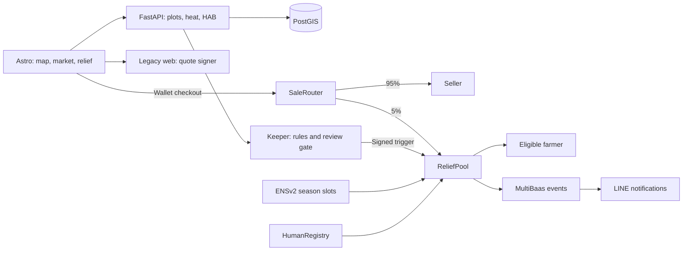

<p align="center"></p>

# Reel Deal

**Community-funded relief payments for aquaculture farmers.**

Buy local seafood. Put **5% of each purchase into a relief fund**. Use public ocean
data and species-specific rules to direct JPYC relief to eligible farmers.

Built at ETHGlobal Tokyo 2026, Classic track. The deployed contracts use
**Sepolia, chain 11155111**.

[Coastal map](https://app.13-196-78-137.sslip.io/hmi) ·
[Fish market](https://app.13-196-78-137.sslip.io/market) ·
[Relief dashboard](https://app.13-196-78-137.sslip.io/relief) ·
[LINE farmer app](https://liff.line.me/2011749457-SgvM5ahH) ·
[Submission](docs/SUBMISSION.md) · [Form text](docs/FORM.md)

## The problem

Heat stress and shipping restrictions disrupt aquaculture livelihoods. Farmers,
co-ops and supporters need a shared view of ocean conditions, clear relief rules
and a record of where contributions go. A restriction bulletin is evidence of
constrained sales; it does not measure an individual farm's loss.

## What Reel Deal does

| Screen | Purpose |
| --- | --- |
| Coastal map | Explore Japan's coast from Miyagi: plot polygons, satellite imagery, sea temperature/anomaly, chlorophyll, species thresholds and advisory forecast playback. Select a plot or draw an area. |
| Fish market | Scallop, sea pineapple (hoya) and oyster lead the catalogue. Review the price and **95% seller / 5% relief** split before wallet checkout. |
| Relief | Inspect fund balances, contributions, plot outcomes, payment evidence and held-payment claims. |
| LINE | Farmer identity, season slots, wallet and payment notifications through LIFF. |

The map and market support English/Japanese. Mobile map controls collapse; market
purchase reviews use a dialog. Generated seafood illustrations are documented in
[asset provenance](frontend/public/images/fish/README.md).

## How it works

1. A donation or SaleRouter checkout funds ReliefPool in JPYC.
2. A farmer holds an ENSv2 plot season slot and verifies identity with World ID.
3. The pipeline supplies ocean observations and reviewed restriction indices.
   Shared species rules determine whether a relief trigger fires.
4. The keeper applies the confidence/review gate and submits a signed trigger.
   ReliefPool requires two signer signatures.
5. Settlement resolves the season-slot owner and either pays or records a held
   share with a reason. MultiBaas events drive the LINE notification path.

Forecast playback is advisory. Moving the slider does not trigger a payment.

## Architecture



Astro is the main UI on AWS EC2. The legacy `web/` service on Railway still owns
quote signing, the keeper, LINE and remaining co-op/holder/verification pages.
Astro redirects those pages explicitly. Storybook is a separate component catalogue.

| Directory | Responsibility |
| --- | --- |
| [`frontend/`](frontend/README.md) | Astro screens, wallet islands and Storybook |
| [`pipeline/`](pipeline/README.md) | FastAPI plot inventory, heat and HAB data |
| [`db/`](db/README.md) | PostGIS schema, migrations and deployment |
| `web/` | Quote signer, keeper, LINE and legacy routes |
| `contracts/` | Solidity ReliefPool, SaleRouter, HumanRegistry and ENS adapters |
| `packages/shared/` | Rules, schemas, catalogue, ABIs and addresses |

[Pipeline interface](docs/INTERFACE.md) · [ADRs](docs/adrs) ·
[HMI handoff](docs/HMI-HANDOFF.md) · [Deployment](frontend/DEPLOY.md)

## Integration evidence

| Integration | Role | Implementation / evidence |
| --- | --- | --- |
| ENSv2 | Resolve the current holder of a plot's expiring season slot | [ENS adapters](contracts/src/adapters), [deployment and recorded runs](docs/SUBMISSION.md#deployed-addresses-sepolia-chain-11155111) |
| World ID | Bind a verified person to a wallet and cap relief units per person | [HumanRegistry](contracts/src/HumanRegistry.sol), [verification record](docs/WORLD_DEBRIEF.md) |
| Curvegrid MultiBaas | Index relief events and deliver authenticated webhooks | [Integration](docs/MULTIBAAS.md) |
| JPYC | Sale, donation and relief currency, with 18-decimal accounting | [SaleRouter](contracts/src/SaleRouter.sol), [ReliefPool](contracts/src/ReliefPool.sol) |
| LINE | LIFF farmer interface and payment notifications | [LINE integration](web/src/lib/line.ts) |
| TypeSafe Jev | Typed confidence gate and fixed bilingual reply selection | [Integration and recorded calls](docs/JEV.md) |

Sepolia contracts: [ReliefPool](https://sepolia.etherscan.io/address/0xB25888A81B6F2D337c2f0CBFB863324F258c43e5),
[SaleRouter](https://sepolia.etherscan.io/address/0xfc178e7fA7b3119e2E233FeDF5e2E317D95658bd),
[HumanRegistry](https://sepolia.etherscan.io/address/0xc713c174b33B071f7Bf6dC571E3dd7BfB441D4F8).
The [recorded end-to-end run](docs/SUBMISSION.md#recorded-end-to-end-run-2026-09-26)
links donations, attestations and settlements. No new transaction is implied by a UI screenshot.

## Run locally

Use Bun 1.3.14, Node 24 and uv. Foundry is required for contract tests; Docker is
required for the disposable PostGIS integration tests.

```sh
git clone --recurse-submodules https://github.com/reeldeal-xyz/reeldeal.git
cd reeldeal
bun install --frozen-lockfile
cp .env.example .env
cp frontend/.env.example frontend/.env
(cd pipeline && uv sync)
```

Configure the backend origins and RPC in `frontend/.env`; see the
[frontend guide](frontend/README.md). Start each service in its own terminal:

```sh
bun run frontend:dev  # Astro: http://localhost:4321/hmi
bun run pipeline      # FastAPI: http://localhost:8787
bun run dev           # Legacy service: http://localhost:3000
bun run storybook     # Components: http://localhost:6008
```

A connected plot inventory needs a migrated PostGIS database and pipeline data.
Follow [database setup](db/README.md) and [pipeline setup](pipeline/README.md).
Never commit environment files or signing keys.

## Verify

```sh
bun run frontend:check
bun test frontend/scripts packages/shared/test
bun run frontend:build
bun run --cwd frontend smoke:built
bun run storybook:build
bun run pipeline:test
bun run contracts:test
bun run dog:map
bun run dog:check
```

CI also exercises the API against migrated PostGIS and smoke-tests the deployed
container routes. The [submission write-up](docs/SUBMISSION.md#tests) describes the
fork-based payout test and its recorded result.

## Release status

The deployed app reads the plot inventory, heat/HAB data, weather forecast and
Sepolia relief events. Remaining release gaps are recorded in
[submission status](docs/SUBMISSION.md#current-release): the legacy quote service
needs the current hoya/oyster catalogue deployed; storm risk and heat/HAB onset
forecasts are not implemented; imported polygons do not verify farmer ownership.
This is a Sepolia submission, not a mainnet launch.

[Team](docs/SUBMISSION.md#team) · [Research](docs/research/aquaculture-evidence.md) ·
[Original design notes](docs/original-design-notes.md)
