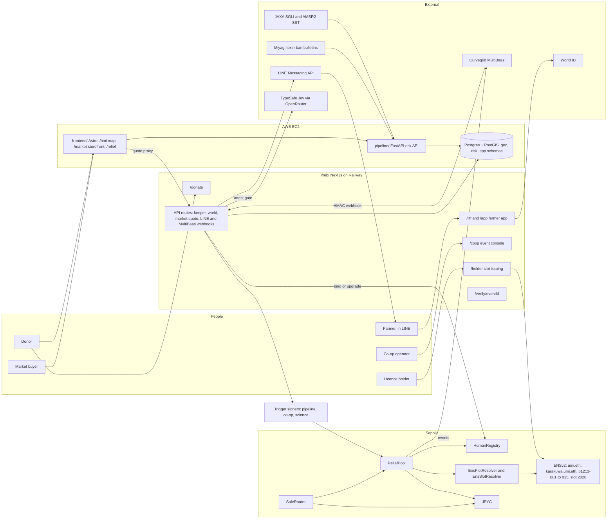
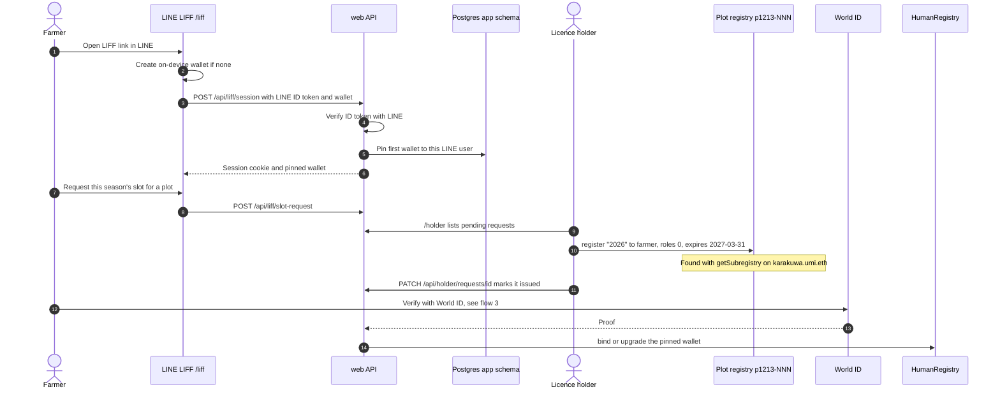
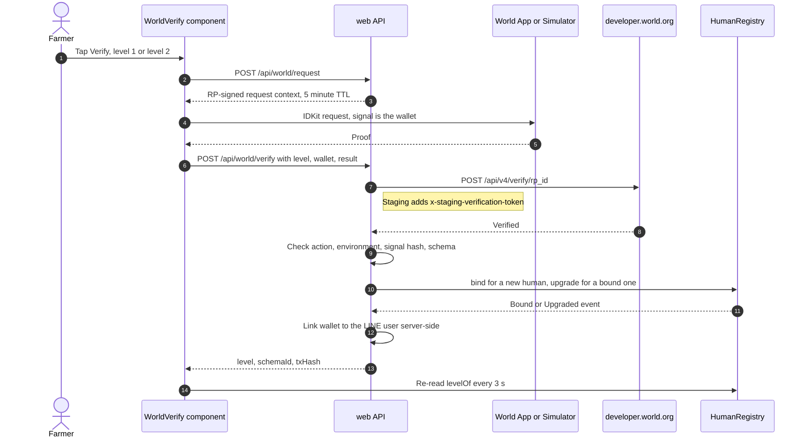
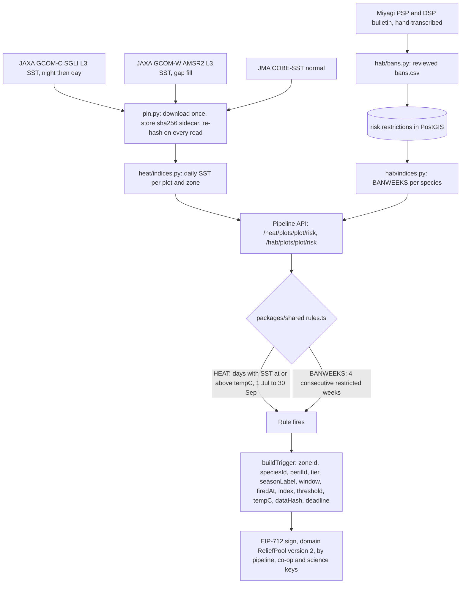
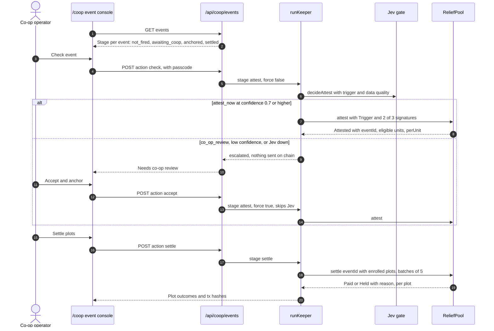
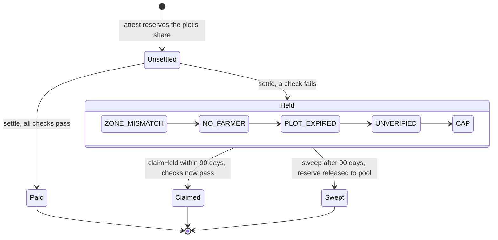
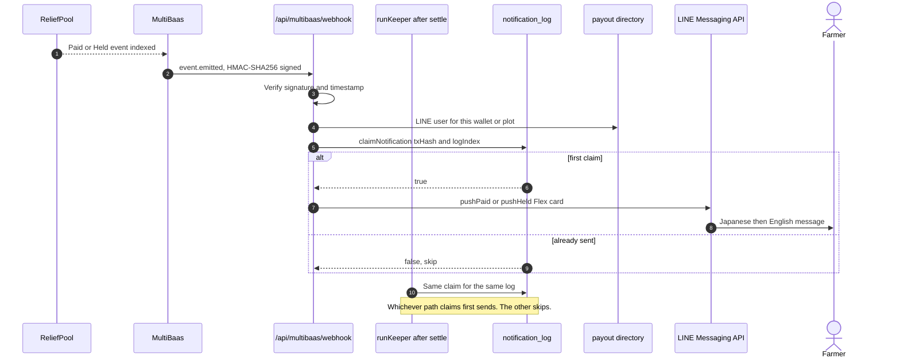
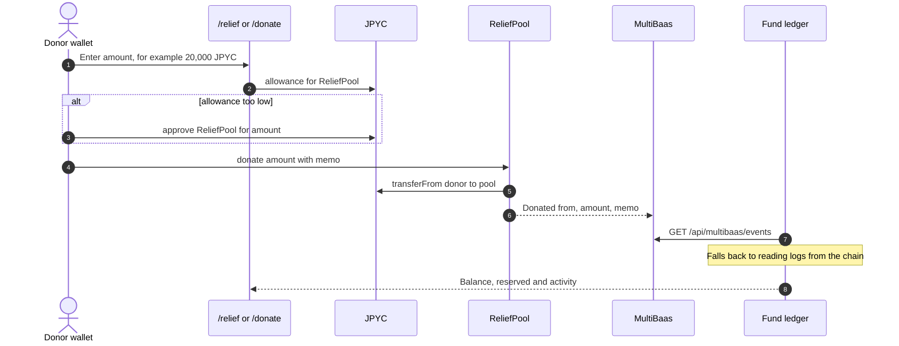
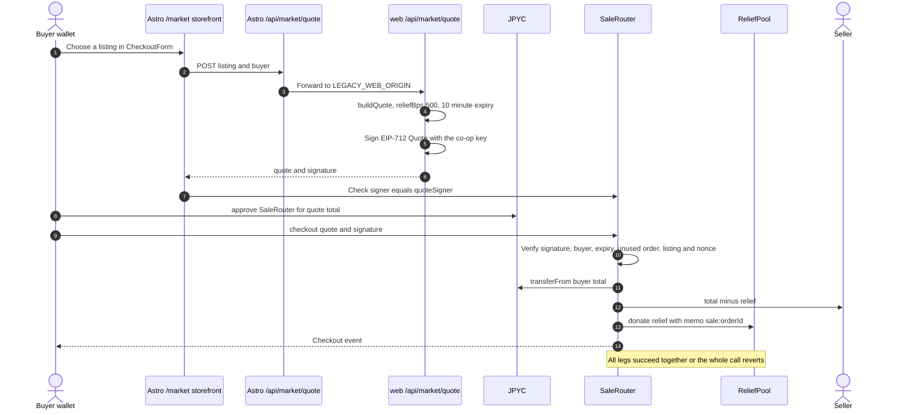
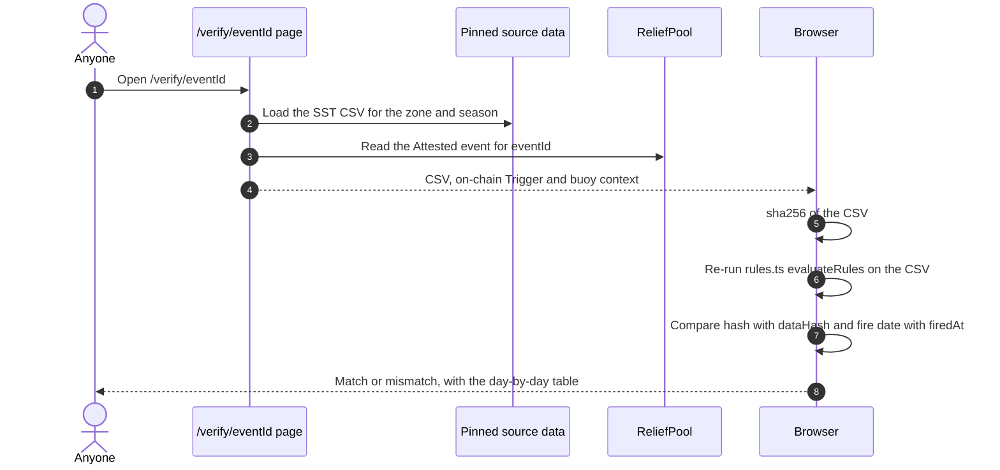

<p align="center"></p>

# Reel Deal

**Community-funded relief payments for aquaculture farmers.**

Buy local seafood. Put **5% of each purchase into a relief fund**. Use public ocean
data and species-specific rules to direct JPYC relief to eligible farmers.

Built at ETHGlobal Tokyo 2026, Classic track. The deployed contracts use
**Sepolia, chain 11155111**.

[Coastal map](https://app.13-196-78-137.sslip.io/hmi) ·
[Fish market](https://app.13-196-78-137.sslip.io/market) ·
[Relief dashboard](https://app.13-196-78-137.sslip.io/relief) ·
[LINE farmer app](https://liff.line.me/2011749457-SgvM5ahH) ·
[Submission](docs/SUBMISSION.md) · [Form text](docs/FORM.md)

[Problem](#the-problem) · [Demo](#demo) · [How it works](#how-it-works) ·
[Integration evidence](#integration-evidence) · [Run locally](#run-locally) ·
[Release status](#release-status)

## The problem

Heat stress and shipping restrictions disrupt aquaculture livelihoods. Farmers,
co-ops and supporters need a shared view of ocean conditions, clear relief rules
and a record of where contributions go. A restriction bulletin is evidence of
constrained sales; it does not measure an individual farm's loss.

## What Reel Deal does

| Screen | Purpose |
| --- | --- |
| Coastal map | Explore Japan's coast from Miyagi: plot polygons, satellite imagery, sea temperature/anomaly, chlorophyll, species thresholds and advisory forecast playback. Select a plot or draw an area. |
| Fish market | Scallop, sea pineapple (hoya) and oyster lead the catalogue. Review the price and **95% seller / 5% relief** split before wallet checkout. |
| Relief | Inspect fund balances, contributions, plot outcomes, payment evidence and held-payment claims. |
| LINE | Farmer identity, season slots, wallet and payment notifications through LIFF. |

The map and market support English/Japanese. Mobile map controls collapse; market
purchase reviews use a dialog. Generated seafood illustrations are documented in
[asset provenance](frontend/public/images/fish/README.md).

## Demo

1. Open the [coastal map](https://app.13-196-78-137.sslip.io/hmi). Select a farm
   plot, inspect ocean observations, and compare the species-specific relief rules.
2. Open the [fish market](https://app.13-196-78-137.sslip.io/market). Review a
   scallop, hoya or oyster purchase and its **95% seller / 5% relief** split.
3. Open the [relief dashboard](https://app.13-196-78-137.sslip.io/relief). Inspect
   contributions, plot outcomes and payment evidence.
4. Follow the [recorded payout](docs/SUBMISSION.md#recorded-end-to-end-run-2026-09-26)
   from donation to attestation and settlement. The [LINE app](https://liff.line.me/2011749457-SgvM5ahH)
   provides the farmer's identity, season-slot and payment views.

Browsing the map, purchase review and relief ledger requires no wallet. Wallet
actions use Sepolia. The [three-minute demo script](docs/SUBMISSION.md#demo-script-3-minutes)
provides the presentation sequence.

## How it works

1. A donation or SaleRouter checkout funds ReliefPool in JPYC.
2. A farmer holds an ENSv2 plot season slot and verifies identity with World ID.
3. The pipeline supplies ocean observations and reviewed restriction indices.
   Shared species rules determine whether a relief trigger fires.
4. The keeper applies the confidence/review gate and submits a signed trigger.
   ReliefPool requires two signer signatures.
5. Settlement resolves the season-slot owner and either pays or records a held
   share with a reason. MultiBaas events drive the LINE notification path.

Forecast playback is advisory. Moving the slider does not trigger a payment.

The diagrams below are drawn from the code on `main`. Each one is followed by the files that
implement it.

### 1. System overview



- **Two web apps.** `web/` (Next.js, Railway) is the operational app: the LINE farmer app, co-op
  console, holder screen, donor screen, public verifier, and every server route that holds a key.
  `frontend/` (Astro, EC2) is the public face: the `/hmi` risk map, the `/market` storefront and the
  `/relief` dashboard. It reads the chain and the pipeline directly. It forwards quote signing to
  `web/` through `LEGACY_WEB_ORIGIN` (`frontend/src/pages/api/market/quote.ts`).
- **Pipeline.** `pipeline/` (Python, uv, FastAPI) pins raw data by sha256 and serves per-plot risk
  indices. It shares the Postgres + PostGIS service in `db/`, where the pipeline owns the `geo` and
  `risk` schemas and `web/` owns `app` (`web/src/db/schema.ts`).
- **Contracts.** `contracts/src/ReliefPool.sol`, `HumanRegistry.sol` and `SaleRouter.sol`, plus the
  ENSv2 adapters in `contracts/src/adapters/`. Their Solidity structs are mirrored in `packages/shared`
  (`trigger.ts`, `quote.ts`, `addresses.ts`).
- **Money only moves on deterministic checks.** Jev can delay an attest by asking for co-op review,
  but it never calls `attest` or `settle` itself (`web/src/lib/jev-gate.ts`, `docs/JEV.md`).

<details>
<summary>Detailed flows: onboarding, identity, triggers, settlement, notifications and checkout</summary>

### 2. Farmer onboarding



- **LINE login.** `web/src/app/api/liff/session/route.ts` checks the LIFF ID token against LINE
  (`web/src/lib/line-auth.ts`) and sets a signed session cookie (`web/src/lib/session.ts`).
- **One wallet per LINE user.** The browser makes a Sepolia wallet on first open
  (`web/src/lib/wallet.ts`, a demo custody model). The server pins the first wallet a LINE user presents
  and returns it on every later session (`pinWalletForLineUser` in `web/src/lib/payout-directory.ts`,
  stored in `app.wallet_links`). That way a second browser can't split the verified wallet from the
  plot owner.
- **Season slot.** The ENS name is `umi.eth` → `karakuwa.umi.eth` → `p1213-001` … `p1213-015`
  (8 scallop, 4 hoya, 3 oyster, zone `karakuwa-east`) → season label `2026`. The licence holder issues
  the slot from `/holder` with their own wallet. `issueSeasonSlot` in `web/src/lib/ens-adapter.ts`
  finds the plot's own registry with `getSubregistry(plotLabel)`, then calls
  `register("2026", farmer, …, roleBitmap 0, expiry)`. A role bitmap of 0 makes the slot
  non-transferable. The expiry is 31 March 2027 (`web/src/components/holder/holder-screen.tsx`).
- **Plot facts.** A plot's `zone` and `species` are ENSv2 text records. `EnsPlotResolver` reads them.
  `ReliefPool.enroll(plotLabel)` caches them on chain.

### 3. World ID verification



- **Levels.** Level 1 is Selfie Check (schema 11, action `bind-payout-wallet`). Level 2 is World ID
  **Orb** only (schema 1, `proof_of_human`) (`web/src/lib/world/schema.ts`). My Number Card and
  passport are **not integrated**. The deployed HumanRegistry would still map schemas 9303 and 9310 to
  level 2, but the app never requests them and the server rejects them.
- **Caps.** ReliefPool pays at most `unitCap[1] = 3` plots per event to a level-1 human and
  `unitCap[2] = 12` to a level-2 human. The cap is counted per nullifier, not per wallet.
- **Server-side proof check.** `web/src/lib/world/signing.ts` signs the request context with
  `WORLD_RP_SIGNING_KEY`. `web/src/lib/world/verify-client.ts` calls the v4 verify endpoint.
  `web/src/lib/world/credential.ts` picks the matching credential. `web/src/lib/world/binder.ts` sends
  `HumanRegistry.bind` or `upgrade` with the binder key.
- **Simulator.** Staging support is in `web/src/components/WorldVerify.tsx` and `credential.ts`. The
  World ID Simulator has no Selfie Check credential, so a level-1 request there asks for the Human
  (Orb) credential and binds it at its real level, 2.
- **LIFF reloads.** LINE's in-app browser reloads the page when World App returns. That's why the
  server links the wallet to the LINE user itself instead of waiting for the client
  (`web/src/app/api/world/verify/route.ts`, `docs/WORLD_DEBRIEF.md`).

### 4. Risk detection and trigger



- **Pinned inputs.** `pipeline/src/pipeline/core/clients/jaxa_earth.py` reads JAXA Earth's public
  STAC/COG store. `pipeline/src/pipeline/core/pin.py` writes each file once with a `.pin.json`
  sidecar (`url`, `sha256`, `size`, `fetched_at`) and refuses to read bytes that no longer match. Every
  index value carries that `source.sha256`.
- **Heat.** `pipeline/src/pipeline/hazards/heat/indices.py` fills each day from SGLI night, then SGLI
  day, then AMSR2 night. It also derives `SST_ANOM` against the COBE normal.
- **Toxin bans.** Miyagi's shellfish-toxin table goes through human review into
  `risk.restrictions` (`pipeline/src/pipeline/hazards/hab/bans.py`). `BANWEEKS` counts consecutive
  restricted weeks. The heat and HAB routes are live. Storm routes, and the heat/HAB forecast routes,
  still return 501.
- **Rules.** `packages/shared/src/rules.ts` loads `species.data.json`, generated from
  `pipeline/data/ref/species.json`:

  | Species | Tier | Peril | Fires when |
  |---|---|---|---|
  | scallop | 1 | HEAT | 14 days at 25 °C or above, 1 Jul to 30 Sep |
  | scallop | 2 | HEAT | 12 days at 26 °C or above |
  | hoya | 1 | HEAT | 30 days at 24 °C or above |
  | oyster, scallop | 1 | BANWEEKS | 4 consecutive weeks under a shipment ban |

- **The Trigger.** Defined in `packages/shared/src/trigger.ts` and `contracts/src/interfaces/IReliefPool.sol`.
  `tempC` is the rule's threshold temperature (0 for bans). `dataHash` is the sha256 of the pinned source
  series, so anyone can recount the days.
- **Signing.** `web/src/lib/keeper/signing.ts` takes the signed Trigger from the pipeline feed. If the
  feed is missing or has too few signatures, it tops up locally with `PIPELINE_SIGNER_PRIVATE_KEY`,
  `COOP_SIGNER_PRIVATE_KEY` and `SCIENCE_KEY_PRIVATE_KEY`.

### 5. Event lifecycle in the co-op console



- **Console routes.** `web/src/app/api/coop/events/route.ts`. `GET` lists every reference event
  with its stage from `web/src/lib/keeper/event-status.ts`. `POST` takes `check`, `accept` or `settle`,
  guarded by `COOP_PASSCODE`. `settle` on an event that isn't anchored yet returns 409.
- **Keeper.** `web/src/lib/keeper/run.ts` (`runKeeper`) reads the attestation, loads and checks the
  signed Trigger, runs the Jev gate unless `force` is set, sends `attest`, then finds enrolled plots from
  `Enrolled` logs (`web/src/lib/keeper/plots.ts`) and settles them.
- **Jev gate.** `web/src/lib/jev-gate.ts` asks TypeSafe Jev (`typesafe/jev-1.13` through the
  OpenRouter Decisions API) to choose `attest_now` or `co_op_review`. Anything below
  `JEV_CONFIDENCE_THRESHOLD` (default 0.7), or any failure, becomes `co_op_review`.
- **On chain.** `ReliefPool.attest` needs `signerThreshold` distinct signers (2 of 3) over the
  EIP-712 domain `ReliefPool` version `2`. It checks the deadline, that the window has ended, and that
  `index >= threshold`. It reserves `perUnit = min(tierAmount, free balance / eligible units)` for every
  eligible unit.

### 6. Settlement, holds and claims



- **Checks, in order** (`_checkEligibility` in `contracts/src/ReliefPool.sol`). The first failing
  check becomes the hold reason.
  - `ZONE_MISMATCH`: the plot isn't enrolled, or its zone or species changed.
  - `NO_FARMER`: no one holds the season slot.
  - `PLOT_EXPIRED`: the slot has expired.
  - `UNVERIFIED`: the holder's wallet has no World ID level.
  - `CAP`: the human already hit `unitCap[level]` for this event.
- **Claims.** A held farmer who fixes the cause can call `claimHeld(eventId, plotLabel)` before
  `claimDeadline` (90 days after the attest). It always pays the current slot owner. From LINE the
  claim is gasless: `POST /api/liff/claim` (`web/src/lib/liff/claim.ts`) sends it with the keeper
  relayer's gas. From the web, `/relief` offers the same call through
  `frontend/src/components/solid/ReliefClaimAction.tsx`.
- **Sweep.** After the deadline, `sweep` frees the held share back into the pool. No tokens move.
  The pool keeps `reserved == pending + held` at all times.
- **Readable reasons.** Farmer-facing Japanese and English text for each reason is in
  `web/src/lib/held-reasons.ts`.

### 7. Notification



- **Webhook.** `web/src/app/api/multibaas/webhook/route.ts` checks `X-MultiBaas-Signature`, an
  HMAC-SHA256 of body plus timestamp keyed by `MULTIBAAS_WEBHOOK_SECRET`
  (`verifyMultiBaasSignature` in `web/src/lib/multibaas.ts`). `Paid` and `Held` become LINE pushes.
  `Donated` and `Attested` are only logged.
- **Two senders, one message.** The keeper also pushes right after `settle`
  (`web/src/lib/keeper/run.ts`). Both paths call `claimNotification` in
  `web/src/lib/notification-log.ts`. It inserts `txHash:logIndex` into `app.notification_log` with
  on-conflict-do-nothing, so each chain event is pushed once. Without `DATABASE_URL` it falls back
  to a JSON file.
- **LINE.** `web/src/lib/line.ts` builds the `pushPaid` / `pushHeld` Flex bubbles and mints a
  short-lived channel token. The LINE webhook (`web/src/app/api/line/webhook/route.ts`) answers
  farmer questions with a canned bilingual reply picked by Jev. It hands off to the co-op when Jev isn't
  sure.
- **Setup.** `bun run multibaas:setup` (`scripts/multibaas-setup.ts`) links the contracts and
  registers the webhook. See `docs/MULTIBAAS.md`.

### 8. Donation



- **Two donation screens.** The Astro `/relief` page uses `frontend/src/components/solid/DonateForm.tsx`.
  The Next.js `/donate` page uses `web/src/components/donate/donate-screen.tsx`. Both use plain
  `approve` then `ReliefPool.donate(amount, memo)`. JPYC has 18 decimals, so ¥20,000 is `20000e18`.
- **Ledger.** `web/src/app/api/multibaas/events/route.ts` serves indexed events from MultiBaas and
  falls back to `getLogs` when MultiBaas isn't configured. `/relief` reads the fund summary and each
  plot's settlement straight from chain (`frontend/src/lib/chain/client.server.ts`, also served as
  `GET /api/relief/fund` and `GET /api/relief/plot/[plot]`).

### 9. Marketplace sale



- **Storefront.** `frontend/src/pages/market/index.astro` renders
  `frontend/src/components/organisms/marketplace/MarketplaceDiscovery.astro`. That opens
  `frontend/src/components/solid/CheckoutForm.tsx`, with the steps in `checkout-services.ts`. A pending
  purchase survives a reload through `localStorage`.
- **Quote.** `frontend/src/pages/api/market/quote.ts` validates the listing and forwards to
  `web/src/app/api/market/quote/route.ts`, because the signing key lives only in `web/`. `buildQuote`
  and `signSaleQuote` are in `packages/shared/src/market-quote.ts` and `quote.ts`. The EIP-712 domain is
  `SaleRouter` version `1`. The fields are `orderId, listingId, buyer, seller, total, reliefBps, nonce,
  expiry`.
- **Split.** `contracts/src/SaleRouter.sol` computes `relief = floor(total × reliefBps / 10000)`. The
  seller gets the rest. Listings quote 5% (`MARKET_RELIEF_BPS = 500`), and the router refuses anything
  above its `maxReliefBps` of 10%. The pool's `Donated` event with memo `sale:<orderId>` ties the
  relief leg back to the sale. See `docs/SALE-ROUTER.md`.

### 10. Public verification



- **Files.** `web/src/app/verify/[eventId]/page.tsx` resolves the event, loads the CSV and reads the
  on-chain Trigger. `web/src/components/verify/VerifyClient.tsx` hashes and recomputes in the browser
  with `sha256Hex`, `parseErddapCsv` and `evaluateRules` from `@repo/shared`. The browser runs the same
  rule code the Trigger was built with.
- **Scope.** This covers HEAT events. BANWEEKS events come from a PDF bulletin, so the page shows
  them as recorded rather than recomputed.
- **Why it matters.** `dataHash` on chain is the sha256 of the pinned input, and `rules.ts` is public.
  Nobody has to trust the keeper to check that a payout was owed.

</details>

## Architecture

Astro is the main UI on AWS EC2. The legacy `web/` service on Railway still owns
quote signing, the keeper, LINE and remaining co-op/holder/verification pages.
Astro redirects those pages explicitly. Storybook is a separate component catalogue.

| Directory | Responsibility |
| --- | --- |
| [`frontend/`](frontend/README.md) | Astro screens, wallet islands and Storybook |
| [`pipeline/`](pipeline/README.md) | FastAPI plot inventory, heat and HAB data |
| [`db/`](db/README.md) | PostGIS schema, migrations and deployment |
| `web/` | Quote signer, keeper, LINE and legacy routes |
| `contracts/` | Solidity ReliefPool, SaleRouter, HumanRegistry and ENS adapters |
| `packages/shared/` | Rules, schemas, catalogue, ABIs and addresses |

[Pipeline interface](docs/INTERFACE.md) · [ADRs](docs/adrs) ·
[HMI handoff](docs/HMI-HANDOFF.md) · [Deployment](frontend/DEPLOY.md)

## Deployed

| What | URL | Hosting |
|---|---|---|
| Map, marketplace, relief dashboard (Astro `frontend/`) | <https://app.13-196-78-137.sslip.io> (`/hmi`, `/market`, `/relief`) | AWS EC2 (Tokyo), Caddy |
| Co-op, holder, donor and farmer web app (Next.js `web/`) | <https://web-production-746aa.up.railway.app> (`/coop`, `/holder`, `/donate`, `/app`, `/verify/[eventId]`) | Railway |
| Farmer app in LINE (LIFF) | <https://liff.line.me/2011749457-SgvM5ahH> (opens `web/` `/liff`) | Railway, inside LINE |
| Pipeline risk API (FastAPI) | <https://13-196-78-137.sslip.io> (`/health`, `/plots`, `/heat/*`, `/hab/*`) | AWS EC2, with PostGIS |

### Contracts (Sepolia, chain id 11155111)

Source of truth: [`packages/shared/src/addresses.ts`](packages/shared/src/addresses.ts).

| Contract | Address | Role |
|---|---|---|
| ReliefPool (v2) | [`0xB25888A81B6F2D337c2f0CBFB863324F258c43e5`](https://sepolia.etherscan.io/address/0xB25888A81B6F2D337c2f0CBFB863324F258c43e5) | Holds donations, verifies 2-of-3 signed Triggers, pays or holds per plot |
| HumanRegistry | [`0xc713c174b33B071f7Bf6dC571E3dd7BfB441D4F8`](https://sepolia.etherscan.io/address/0xc713c174b33B071f7Bf6dC571E3dd7BfB441D4F8) | Wallet ↔ World ID nullifier binding and level |
| SaleRouter | [`0xfc178e7fA7b3119e2E233FeDF5e2E317D95658bd`](https://sepolia.etherscan.io/address/0xfc178e7fA7b3119e2E233FeDF5e2E317D95658bd) | Atomic marketplace checkout: pays the seller and donates the relief share |
| EnsPlotResolver | [`0x5Fd09356151DfF3DFca06B1270e5DDAF11DaF89b`](https://sepolia.etherscan.io/address/0x5Fd09356151DfF3DFca06B1270e5DDAF11DaF89b) | Reads a plot's `zone` / `species` text records from ENSv2 |
| EnsSlotResolver | [`0xbf91d74c0010ba727bD3B251B3fc5700835c80Ec`](https://sepolia.etherscan.io/address/0xbf91d74c0010ba727bD3B251B3fc5700835c80Ec) | Reads who holds a plot's season slot, and until when |
| JPYC | [`0xE7C3D8C9a439feDe00D2600032D5dB0Be71C3c29`](https://sepolia.etherscan.io/address/0xE7C3D8C9a439feDe00D2600032D5dB0Be71C3c29) | Payment token (18 decimals) |

ENSv2 on Sepolia is redeployed about monthly; its registry addresses are also in `addresses.ts`.

## Integration evidence

| Integration | Role | Implementation / evidence |
| --- | --- | --- |
| ENSv2 | Resolve the current holder of a plot's expiring season slot | [ENS adapters](contracts/src/adapters), [deployment and recorded runs](docs/SUBMISSION.md#deployed-addresses-sepolia-chain-11155111) |
| World ID | Bind a verified person to a wallet and cap relief units per person | [HumanRegistry](contracts/src/HumanRegistry.sol), [verification record](docs/WORLD_DEBRIEF.md) |
| Curvegrid MultiBaas | Index relief events and deliver authenticated webhooks | [Integration](docs/MULTIBAAS.md) |
| JPYC | Sale, donation and relief currency, with 18-decimal accounting | [SaleRouter](contracts/src/SaleRouter.sol), [ReliefPool](contracts/src/ReliefPool.sol) |
| LINE | LIFF farmer interface and payment notifications | [LINE integration](web/src/lib/line.ts) |
| TypeSafe Jev | Typed confidence gate and fixed bilingual reply selection | [Integration and recorded calls](docs/JEV.md) |

Contract addresses are in the [Deployed](#deployed) table.
The [recorded end-to-end run](docs/SUBMISSION.md#recorded-end-to-end-run-2026-09-26)
links donations, attestations and settlements. No new transaction is implied by a UI screenshot.

## Run locally

Use Bun 1.3.14, Node 24 and uv. Foundry is required for contract tests; Docker is
required for the disposable PostGIS integration tests.

```sh
git clone --recurse-submodules https://github.com/reeldeal-xyz/reeldeal.git
cd reeldeal
bun install --frozen-lockfile
cp .env.example .env
cp frontend/.env.example frontend/.env
(cd pipeline && uv sync)
```

Configure the backend origins and RPC in `frontend/.env`; see the
[frontend guide](frontend/README.md). Start each service in its own terminal:

```sh
bun run frontend:dev  # Astro: http://localhost:4321/hmi
bun run pipeline      # FastAPI: http://localhost:8787
bun run dev           # Legacy service: http://localhost:3000
bun run storybook     # Components: http://localhost:6008
```

A connected plot inventory needs a migrated PostGIS database and pipeline data.
Follow [database setup](db/README.md) and [pipeline setup](pipeline/README.md).
Never commit environment files or signing keys.

## Verify

```sh
bun run frontend:check
bun test frontend/scripts packages/shared/test
bun run frontend:build
bun run --cwd frontend smoke:built
bun run storybook:build
bun run pipeline:test
bun run contracts:test
bun run dog:map
bun run dog:check
```

CI also exercises the API against migrated PostGIS and smoke-tests the deployed
container routes. The [submission write-up](docs/SUBMISSION.md#tests) describes the
fork-based payout test and its recorded result.

## Release status

The deployed app reads the plot inventory, heat/HAB data, weather forecast and
Sepolia relief events. Remaining release gaps are recorded in
[submission status](docs/SUBMISSION.md#current-release): the legacy quote service
must stay on the same shared catalogue revision; storm risk and heat/HAB onset
forecasts are not implemented; imported polygons do not verify farmer ownership.
This is a Sepolia submission, not a mainnet launch.

[Team](docs/SUBMISSION.md#team) · [Research](docs/research/aquaculture-evidence.md) ·
[Original design notes](docs/original-design-notes.md)
